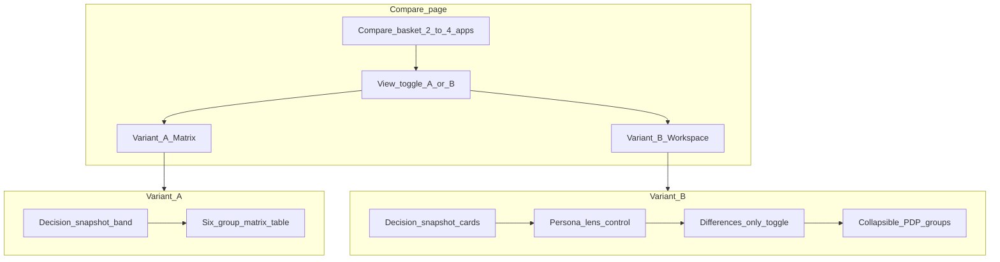

# Comparison tool restructure plan

Status: approved for implementation. Companion to [docs/COMPARE_CONTENT_MAP.md](COMPARE_CONTENT_MAP.md) (row inventory) and the PDP restructure docs ([PDP_RESTRUCTURE_PLAN.md](PDP_RESTRUCTURE_PLAN.md), [PDP_CONTENT_MAP.md](PDP_CONTENT_MAP.md)).

## Goal

Bring `/compare` into line with the restructured product detail page (PDP): same task-labelled content groups, the same decision snapshot signals (where it's live, governance, pricing model, integrations), and persona-aware prioritisation — while shipping **two switchable variants** so ICB commissioners can evaluate which layout best supports shortlisting.

## Current state (what we are changing)

- Route: `app/compare/page.tsx` → `CompareClient.tsx`.
- Three comparison sections: **Clinical context**, **Adoption & assurance**, **Commercial & delivery** — do not match the PDP's six task groups.
- **Live ICB sites** row reads legacy `live_icbs` / `named_sites`, not the canonical `deployment_register` introduced in [PDP_WHERE_ITS_LIVE_REDESIGN.md](PDP_WHERE_ITS_LIVE_REDESIGN.md).
- Empty cells use **"Not stated"**; the PDP sweep standardised on **"Check with supplier"**.
- No decision snapshot band; no persona lensing; no "differences only" filter.
- Journey 3 in [USER_JOURNEY_MAPS.md](USER_JOURNEY_MAPS.md) flags open acceptance: highlight decision-critical rows and validate row priority with ICBs.

## Priority personas

From [PDP_CONTENT_MAP.md](PDP_CONTENT_MAP.md):

| Persona | Role | Compare need |
|---------|------|--------------|
| **Marci** | Condition area owner / commissioner (primary) | Shortlist 2–4 same-condition DTX; defend choice on evidence + deployment + value |
| **Joe** | Strategic commissioner | ROI benchmarks, multi-year funding signals, proven outcomes |
| **Maisie** | Clinical lead + clinical safety officer | Evidence quality, DTAC/DCB, device class, human-wrapper model |
| **Deb** | IG / DPO | DTAC, Cyber Essentials, DSPT, ISO 27001, data hosting |
| **Hashem** | Finance gatekeeper | Pricing model, indicative price, funding eligibility |
| **Sinead** | ICB procurement | Procurement notes, contract terms, DTAC compliance |
| **Marlon** | Population health analyst | Outcomes (limited PDP/compare need) |

## Jobs-to-be-done (compare)

- **Marci:** "When I have 2–4 options in the same condition, I need to see at a glance where each is live, how strong the evidence is, and whether the pricing model fits my business case — without opening four PDPs."
- **Joe:** "I need to compare proven outcomes and funding routes across shortlisted DTX to build a strategic case."
- **Maisie:** "I need DTAC status, evidence strength, and escalation/onboarding detail side by side before I sign off clinically."
- **Hashem:** "I need pricing model and indicative cost in one view to gate affordability."
- **Deb:** "I need assurance badges (DTAC, cyber, ISO) without drilling into each PDP's Safety tab."
- **Sinead:** "I need commercial and governance signals together for procurement due diligence."

## Design options considered

1. **Reorder rows only.** Lowest effort; does not add decision snapshot or persona support. Rejected.
2. **Single redesigned matrix.** Good for familiarity; does not test collapsible workspace or differences-only. Rejected as sole deliverable.
3. **Two variants behind a toggle (chosen).** Variant A keeps the matrix; Variant B offers a decision workspace. De-risks layout choice; toggle syncs to `?view=a|b` and `localStorage`.

## Recommendation: two switchable variants

### Variant A — Aligned matrix

- Sticky **decision snapshot band** per product (Where it's live, Governance, Pricing model, Integrations) — mirrors PDP callouts.
- Matrix sections reordered to the **six PDP task groups** (+ technical).
- **Decision-critical** rows visually flagged (Conditions, Where it's live, Evidence strength, DTAC status, Pricing model).
- Section order follows Marci's persona priority; all rows visible to everyone.

### Variant B — Decision workspace

- Sticky **decision snapshot cards** per product (same four signals).
- **Collapsible grouped sections** per PDP group; decision-critical groups open by default.
- **Persona/task lens** control: Commissioner / Clinical safety / Finance & procurement / Show all — reorders and emphasises groups.
- **"Differences only"** toggle hides rows where all selected apps share the same normalised value.

### Toggle behaviour

- On-page segmented control: **Matrix (A)** | **Workspace (B)**.
- URL param `?view=a` or `?view=b` (shareable); preference persisted in `localStorage` (`hs-compare-view`).
- Independent of the global v1/v2 `hs-design` cookie.

## NHS / GOV.UK alignment

- Decision snapshot reuses PDP segment styling (`hs-snapshot-strip__*`) and NHS blue integration pills.
- Matrix retains accessible table semantics (`caption`, `scope`, sticky header).
- Workspace collapsible sections use `button` + `aria-expanded` (not accordion roles mixed with tabs).
- Empty states use **"Check with supplier"** consistently with the PDP.

## Accessibility

| Element | Requirement |
|---------|-------------|
| Matrix table (A) | `caption`, `scope="col"` / `scope="row"`, sticky first column |
| Snapshot band (A) | `aria-label` on section; keyboard-reachable product links |
| Collapsible groups (B) | `button` triggers, `aria-expanded`, `aria-controls` panel id |
| Lens control (B) | `role="radiogroup"` with `aria-checked` on options |
| Differences only (B) | `aria-live="polite"` announcement when row count changes |
| Targets | Minimum 44px touch targets on toggles and remove buttons |

## Measurement and research plan

| Metric | Method |
|--------|--------|
| Task success (pick a shortlist winner) | Moderated usability, 5 ICB commissioners |
| Time on task | Compare A vs B for same 3-app scenario |
| Differences-only usage | Analytics event on toggle (when instrumented) |
| Lens usage | Analytics event per lens selection |
| Preferred variant | Post-task questionnaire (SUS + preference) |

Hypothesis: Marci completes shortlisting faster on B when comparing 3+ apps; A preferred when printing or sharing a static table.

## Implementation phases

1. **UCD artefacts** — this doc + [COMPARE_CONTENT_MAP.md](COMPARE_CONTENT_MAP.md).
2. **Shared foundation** — `lib/compareConfig.ts`, extended `lib/compareFieldFormat.ts`, `CompareDecisionSnapshot`.
3. **Variant A** — `CompareMatrixView.tsx`.
4. **Variant B** — `CompareWorkspaceView.tsx`, `CompareLensControl.tsx`, differences-only.
5. **Wiring** — `CompareClient.tsx`, `globals.css`, view toggle.
6. **Verify** — type-check, lint, build, manual QA across 2–4 apps.

## Files touched

- `docs/COMPARE_RESTRUCTURE_PLAN.md` (this file)
- `docs/COMPARE_CONTENT_MAP.md`
- `lib/compareConfig.ts`
- `lib/compareFieldFormat.ts`
- `components/compare/CompareDecisionSnapshot.tsx`
- `components/compare/CompareViewToggle.tsx`
- `components/compare/CompareMatrixView.tsx`
- `components/compare/CompareWorkspaceView.tsx`
- `components/compare/CompareLensControl.tsx`
- `components/compare/compareRowRenderers.tsx`
- `app/compare/CompareClient.tsx`
- `app/globals.css`

## Acceptance criteria

- Decision snapshot (four signals) visible in both variants without scrolling past the product summary.
- Matrix sections match the six PDP task groups (+ technical) per the content map.
- "Where it's live" uses `deployment_register` via `getWhereLiveSummary`.
- Empty states read "Check with supplier" (not "Not stated").
- A/B toggle switches layout; `?view=` param and `localStorage` persist preference.
- Variant B: lens reorders groups; differences-only hides identical rows.
- Keyboard and screen-reader operable per accessibility table above.
