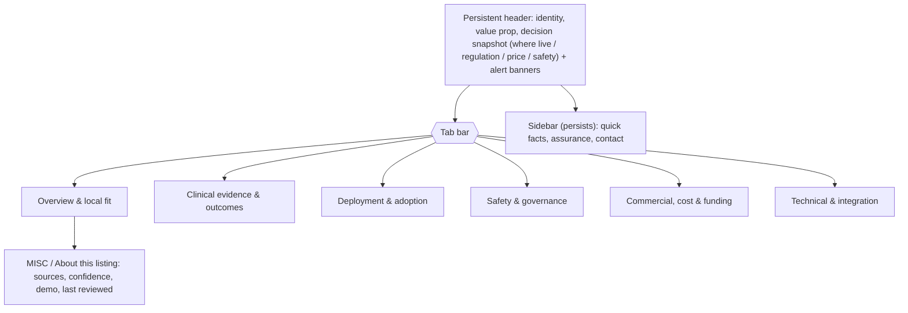

# PDP Restructure Plan

Status: proposal for review. Design pattern and implementation plan for restructuring the product detail page (PDP). Companion to [docs/PDP_CONTENT_MAP.md](PDP_CONTENT_MAP.md), which defines what content goes in each group. No code has been changed; this is the plan to be approved before implementation.

## Goal

Stop burying decision-critical content (where a DTX is live, regulatory and safety status, price) inside 13 collapsed accordions, and regroup the PDP into a small number of intuitive, task-labelled groups that serve the priority commissioning personas (Marci, Joe, Maisie) and the reference personas (Deb, Hashem, Sinead, Marlon).

## Current state (what we are changing)

- PDP route: `app/apps/[slug]/page.tsx`.
- Main column: 13 `ProductPageExpander` cards, all `defaultOpen={false}` — every section starts collapsed.
- Hero + alerts + `PdpCommissioningSnapshot` sit above the expanders; a sidebar (`shareKey: sidebar-summary`) sits in the third column.
- Share/print and the shared view (`app/apps/[slug]/shared/page.tsx`, `PdpSharedProductBody.tsx`) are driven by `shareKey`s registered in `lib/pdpShareKeys.ts`.
- `App` is untyped (`export type App = any` in `lib/data.ts`).

Problem: the accordion-everywhere model treats all content as secondary. UX research (NN/g; B2B IA guidance) is explicit that content central to a decision should not start collapsed, and that buying committees of 5-7 stakeholders are best served by a summary-first, depth-on-demand layout.

## Design options considered

1. **Keep accordions, just reorder.** Lowest effort, but does not solve the core complaint — decision-critical facts still start hidden. Rejected.
2. **Persona-named tabs ("For Commissioners", "For Clinical Safety").** Rejected: NN/g and B2B UX research find users frequently fail to self-identify, and the brief itself says "some need a bit of all" — Marci spans every group.
3. **Pure tabs by content group.** Good for chunking, but tabs hide everything not in the active tab, which taxes the commissioner's need to compare across groups (evidence vs cost) — a documented NN/g anti-pattern.
4. **Anchored single page with sticky in-page nav.** Strong for deep-linking and seeing related sections, but a very long scroll for the dense content set.

## Recommendation: persistent decision snapshot + task-labelled tabs

A hybrid that takes the best of options 3 and 4 and answers the NN/g comparison caveat:

- A **persistent header** (never collapsed) carrying identity + value proposition + a **decision snapshot strip**: where it's live, regulation, indicative price, safety status. These are the facts every persona references, so cross-group comparison does not require switching tabs.
- **Six task-labelled tabs** for the deep content. Content inside a tab is fully visible (no re-collapsing of primary content); only genuinely tertiary detail (e.g. a long methodology note) may use a light `
`/accordion.
- A **persistent sidebar** (quick facts, assurance summary, supplier contact) visible regardless of active tab.
- Tabs are capped at six (within the 5-7 UX guideline) and use descriptive, task/content labels.

Tab labels and the content each owns are defined in [docs/PDP_CONTENT_MAP.md](PDP_CONTENT_MAP.md). Summary:

1. Overview & local fit
2. Clinical evidence & outcomes
3. Deployment & adoption (carries the rescued "where it's live" content)
4. Safety & governance (clinical safety + IG sub-sections)
5. Commercial, cost & funding
6. Technical & integration

## Component-to-group mapping (what moves where)

Existing components are largely reusable; the change is mostly composition (where each block renders) plus a new tab container.

- **New: `PdpTabs` container** (client component). Renders the tab bar + panels; owns active-tab state, ARIA, hash/deep-link sync. Lives alongside `AppDetailClient.tsx`.
- **New: `PdpDecisionSnapshot`** (or extend `PdpCommissioningSnapshot.tsx`). Persistent header strip adding the "Where it's live" signal (count from `named_sites`/`live_icbs`) and a safety-status signal, alongside the existing regulation/price/funding/interop cards.
- **Reuse `ProductPageExpander` bodies, drop the collapse:** the section bodies in `AppDetailSections.tsx` and `pdpBlocks.tsx` move into tab panels. Primary content renders open; `ProductPageExpander` is retained only for tertiary detail.
- **Hero** (`pdpBlocks.tsx`) -> persistent header.
- **Alerts** (`page.tsx`) -> header banners (and detail repeats in Safety & governance).
- **Sidebar** (`page.tsx` `sidebar-summary`) -> persistent sidebar; assurance detail also feeds Safety & governance.
- Section bodies map to tabs exactly as in the content map's "Mapping from current PDP sections to new groups" table.

## Deep-linking, share, and print

The existing share/print machinery keys off `shareKey`s in `lib/pdpShareKeys.ts`. To preserve it:

- Keep all existing `shareKey`s on the moved blocks so `PdpSharePrintContext`, `SharePagePanel`, and the share JWT payloads keep working.
- Add a stable mapping `shareKey -> tabId` so that:
  - Hash deep-links (`#clinical-evidence`, `#commercial-model`, `#nhs-integrations`, `#related-funding`) open the correct tab on load and on `hashchange`, then scroll to the section. UX guidance: a deep link must reveal its target, so the tab must auto-activate.
  - Share-link selections that span multiple tabs still resolve to the right blocks.
- Print and the read-only shared view (`PdpSharedProductBody.tsx`) should render **linearly with all groups expanded** (ignore the tab UI), so a shared/printed PDP shows everything in `PDP_SHARE_KEY_ORDER`. This keeps `PdpSharedProductBody.tsx` in sync without duplicating tab logic.

## Accessibility (ARIA + keyboard)

Follow the WAI tabs pattern (do not reuse accordion semantics):

- Tab bar: `role="tablist"`; each tab `role="tab"`, `aria-selected`, `aria-controls`, roving `tabindex` (`0` on active, `-1` on others).
- Panels: `role="tabpanel"`, `aria-labelledby` the owning tab, `hidden` when inactive.
- Keyboard: Left/Right (and Home/End) move between tabs; Enter/Space activate; Tab moves into the panel.
- Build linear-first: render a readable, ordered document and enhance into tabs with JS, so content survives if scripts fail (also the basis for print/shared view).
- Any retained `ProductPageExpander` keeps its accordion semantics (`aria-expanded`/`aria-controls`) — never mix the two role sets.

## Mobile / responsive

- Tabs at 6 items will not fit a phone width as a single row. Use a horizontally scrollable segmented control or collapse to an accordion on small screens, preserving the same panel content and `tabId`s so deep links keep working across breakpoints.
- The decision snapshot strip stacks vertically on mobile; "Where it's live" and safety status stay at the top.

## Suggested implementation phases

1. **Header + snapshot:** build `PdpDecisionSnapshot` (extend `PdpCommissioningSnapshot.tsx`), move hero and alerts into the persistent header, add the "where it's live" and safety-status signals. Ship behind the existing layout first if needed.
2. **Tab container:** add `PdpTabs` with ARIA + keyboard, render the six panels, move section bodies in per the content map. Keep `shareKey`s intact.
3. **Deep-link + share/print:** add `shareKey -> tabId` mapping; wire hash/`hashchange` to tab activation; make print/shared view render linearly.
4. **Mobile fallback:** segmented control / accordion below the breakpoint.
5. **Content gaps + types (follow-up):** add empty states for `contradictory_evidence`/`product_tiers`; consider introducing a typed `App` interface (replacing `App = any` in `lib/data.ts`) aligned to `ADDING_APPS.md`; raise schema additions for the content gaps listed in the content map (SCAL, DPIA/data-flow, procurement route, utilisation benchmarks, data-return cadence).

## Files likely touched

- `app/apps/[slug]/page.tsx` — recompose into header + tabs + sidebar.
- `app/apps/[slug]/AppDetailClient.tsx` — host `PdpTabs`, wire deep links.
- `components/PdpCommissioningSnapshot.tsx` / new `PdpDecisionSnapshot.tsx` — header snapshot.
- `components/AppDetailSections.tsx`, `app/apps/[slug]/pdpBlocks.tsx` — section bodies into panels.
- New `components/PdpTabs.tsx`.
- `lib/pdpShareKeys.ts` — add `shareKey -> tabId` mapping (keep existing keys/order).
- `app/apps/[slug]/PdpSharedProductBody.tsx`, `app/apps/[slug]/shared/page.tsx` — linear render for share/print.
- `docs/PDP_SECTIONS_DEV_PLAN.md` — update once the new structure lands.

## Acceptance criteria

- "Where it's live" and safety/regulation/price are visible without opening any accordion.
- Each of the six tabs contains exactly the content defined in the content map; no primary content starts collapsed.
- Existing hash deep-links open the correct tab and scroll to the section.
- Share, print, and the read-only shared view render all selected content correctly (linear, all-expanded).
- Tabs are keyboard- and screen-reader-operable per the WAI tabs pattern.
- Mobile renders an equivalent, deep-link-compatible fallback.
