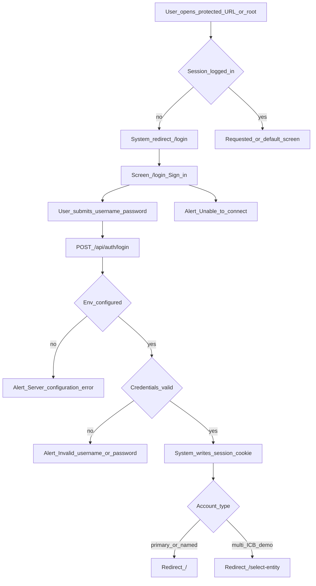
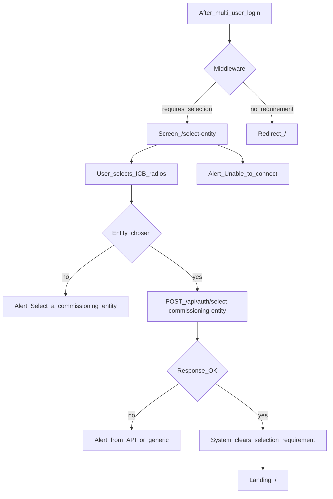
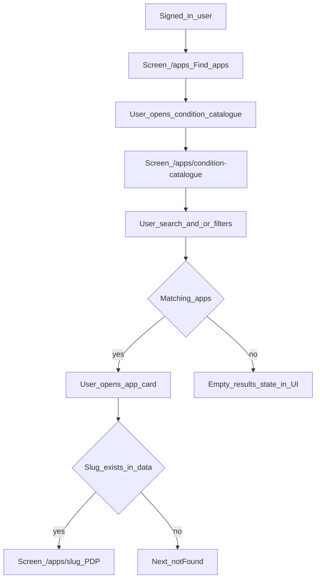
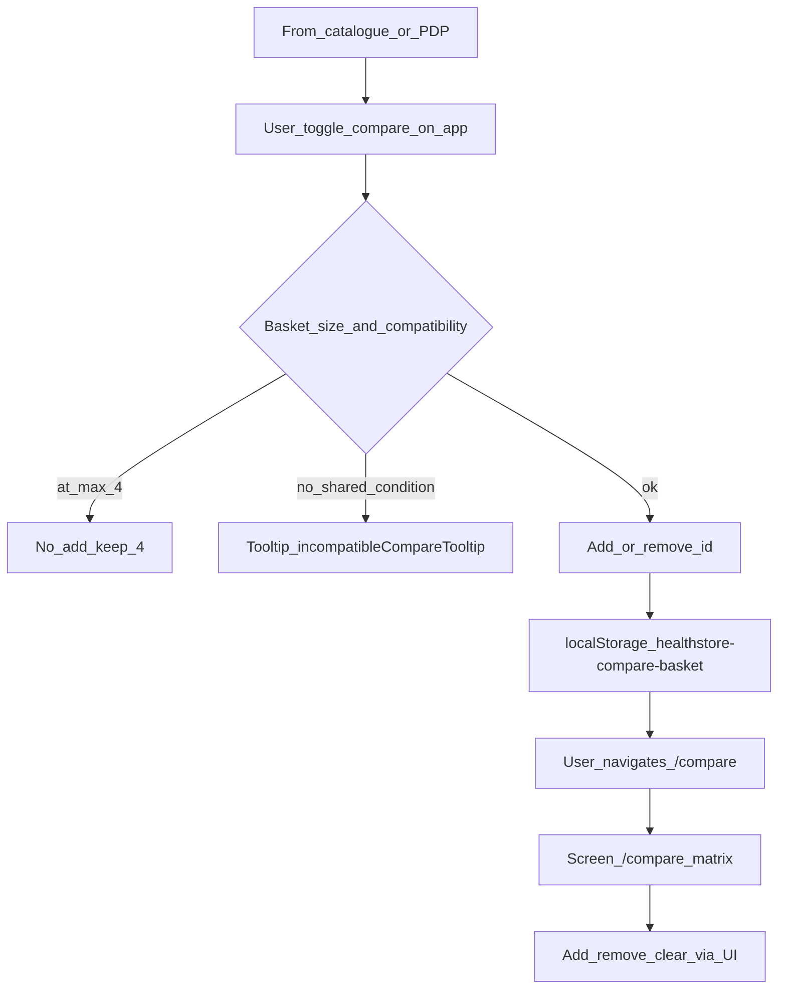
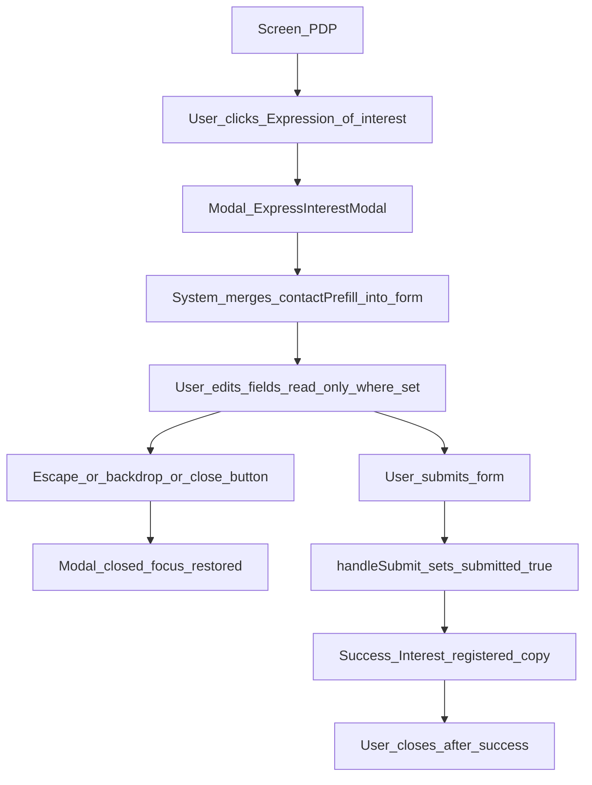
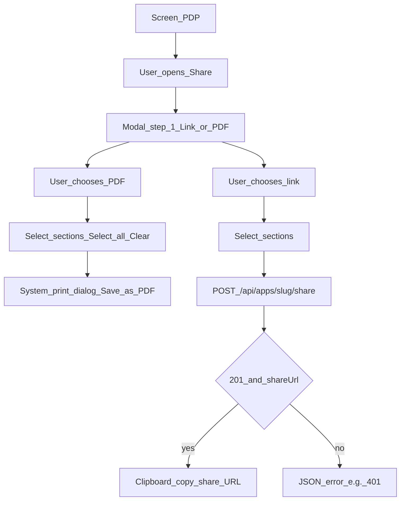
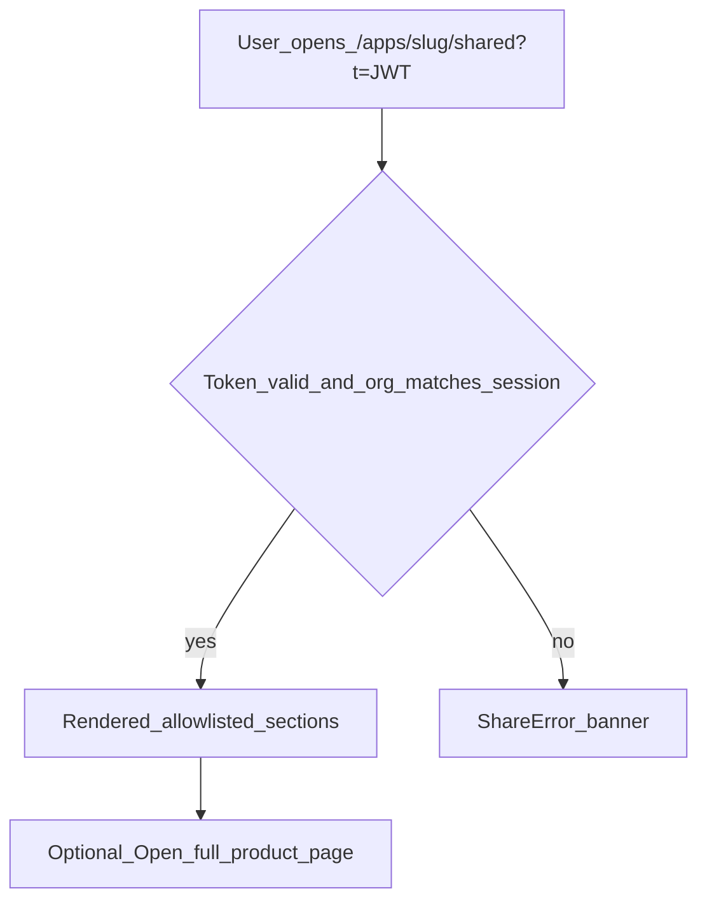
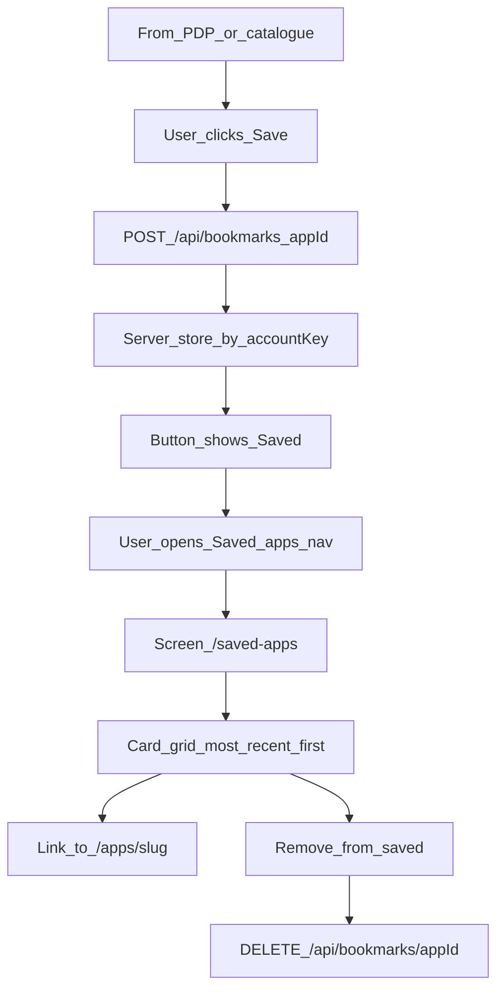

# User flows — Commissioner Store (healthstore-alpha)

**Version:** 1.0  
**Audience:** UX / interaction design, BA (test scenarios), engineering sanity checks.  
**Companion:** Narrative context and service layers live in [`USER_JOURNEY_MAPS.md`](USER_JOURNEY_MAPS.md). Requirements IDs in [`BA_REQUIREMENTS_BASELINE.md`](BA_REQUIREMENTS_BASELINE.md).

---

## How this relates to journey maps

These **user flows** are **screen- and decision-level**: routes, UI states, and branches as implemented in code. [`USER_JOURNEY_MAPS.md`](USER_JOURNEY_MAPS.md) stays the place for **personas**, **emotional hypotheses**, **research hooks**, and **lightweight service blueprint** slices (especially share and EOI).

| Flow ID | Topic | Journey map section |
|---------|--------|---------------------|
| **UF-01** | Log in and session | Journey 1 |
| **UF-02** | Select commissioning entity | Journey 1 |
| **UF-03** | Searching and opening a product | Journey 2 |
| **UF-04** | Comparing apps | Journey 3 |
| **UF-05** | Expression of interest | Journey 5 |
| **UF-06** | Share and PDF | Journey 4 |
| **UF-07** | Save and revisit products | Journey 3b |

---

## Legend

| Symbol | Meaning |
|--------|---------|
| **Screen** | A routable view the user sees (`/path`). |
| **Decision** | User or system branch (yes/no or which path). |
| **System** | Middleware, API, redirect, or persistence without a full page. |
| **Prototype caveat** | Behaviour in this repo that **must not** be read as production NHS capability. |

**Prototype caveats (global):** Demo auth (env passwords / JSON accounts), not NHS Login; expression of interest has **no server-side submit**; share links need **logged-in recipient** with **matching commissioning context**; compare basket uses **localStorage**; saved apps use **account-linked server storage** (JSON file in prototype — swap for KV/DB in production deploys).

---

## Out of scope in this prototype

Operational dashboards (**DTX-530**), national tariff source of truth (**DTX-533**), NHS staff IdP (**DTX-531**), share audit / revocation Track B (**SHR-005**), persisted procurement cases. See BA baseline **§14**.

---

## UF-01 — Log in and session

**Goal:** Authenticate and land in the correct post-login route.  
**Preconditions:** User has credentials for this deployment (primary env user, named account, or multi-ICB demo user).  
**Primary persona:** Any commissioner demo account (see journey maps).

### Flow

### Screen index

- **`/login`** — [`app/login/page.tsx`](../app/login/page.tsx): username/password, show password toggle, submit, `role="alert"` error banner, loading on submit.

### Edge cases

| Case | Behaviour |
|------|-----------|
| Wrong password or unknown user | `401` → `Invalid username or password` (or message from JSON `error`). |
| Network failure | Client catch → `Unable to connect. Please try again.` |
| Missing `AUTH_USERNAME` / hash in env | `500` → `Server configuration error`. |
| Already signed in and visits `/login` | Middleware redirects to `/` or `/select-entity` if `requiresCommissioningEntitySelection` ([`middleware.ts`](../middleware.ts)). |
| Signed in, visits `/cookies` | Allowed without re-login (public route). |

### Traceability

**Journey 1** · `ROL-001`, `ROL-002`, `ROL-003`, `ROL-004`, `AUTH-001`–`AUTH-003`, `AUTH-006` · `UF-01`

---

## UF-02 — Select commissioning entity

**Goal:** Multi-ICB demo user chooses an ICB so the session has a commissioning context before the store.  
**Preconditions:** Session `requiresCommissioningEntitySelection === true` (set on successful multi-user login per [`app/api/auth/login/route.ts`](../app/api/auth/login/route.ts)).  
**Primary persona:** Multi-ICB commissioner (demo).

### Flow

### Screen index

- **`/select-entity`** — [`app/select-entity/SelectEntityForm.tsx`](../app/select-entity/SelectEntityForm.tsx): radio list from [`COMMISSIONING_ENTITIES`](../lib/commissioningEntities.ts), submit, errors.

### Edge cases

| Case | Behaviour |
|------|-----------|
| User tries any other app route while selection required | Middleware redirect to `/select-entity` ([`middleware.ts`](../middleware.ts)). |
| User on `/select-entity` but no longer required | Redirect to `/` ([`middleware.ts`](../middleware.ts)). |
| Submit without selection | Client validation: `Select a commissioning entity to continue.` |

### Traceability

**Journey 1** · `ROL-003`, `IA-010`, `AUTH-004` · `UF-02`

---

## UF-03 — Searching and opening a product

**Goal:** Move from hub to condition catalogue, refine with search/filters, open a product detail page.  
**Preconditions:** User signed in (and entity selected if required).  
**Primary persona:** Commissioner exploring the catalogue.

### Flow

### Screen index

- **`/`** — Optional entry via CTAs to Find apps ([`app/page.tsx`](../app/page.tsx)).
- **`/apps`** — [`app/apps/page.tsx`](../app/apps/page.tsx), [`AppsDiscoveryClient`](../app/apps/AppsDiscoveryClient.tsx).
- **`/apps/condition-catalogue`** — [`CatalogueClient`](../app/apps/CatalogueClient.tsx): filters, search, cards, compare toggles.
- **`/apps/[slug]`** — [`app/apps/[slug]/page.tsx`](../app/apps/[slug]/page.tsx): PDP sections, compare, share, express interest.

### Edge cases

| Case | Behaviour |
|------|-----------|
| Legacy `/apps/browse` | Redirect to condition catalogue with query preserved ([`app/apps/browse/page.tsx`](../app/apps/browse/page.tsx)). |
| Invalid or unknown slug | `notFound()` on PDP route. |
| Condition visibility | Catalogue may hide some conditions per app visibility rules (see [`BA_REQUIREMENTS_BASELINE.md`](BA_REQUIREMENTS_BASELINE.md) catalogue section). |

### Traceability

**Journey 2** · `IA-002`, `IA-003`, `IA-004`, `IA-005`, `CAT-001`, `CAT-002` · `UF-03`

---

## UF-04 — Comparing apps

**Goal:** Build a comparable set of apps and review them on `/compare`.  
**Preconditions:** Signed in; basket context from [`CompareBasketProvider`](../components/CompareBasketProvider.tsx) (wrapped in [`AppShell`](../components/AppShell.tsx)).  
**Primary persona:** Commissioner shortlisting products.

### Flow

**Compatibility rule:** A candidate app must share **at least one** `condition_tags` intersection with the current selection ([`canAddToSelection`](../lib/compareConditions.ts)). Maximum **4** apps ([`CompareBasketProvider`](../components/CompareBasketProvider.tsx)).

### Screen index

- **Catalogue / PDP** — [`CompareToggleButton`](../components/CompareToggleButton.tsx) (and related controls).
- **`/compare`** — [`app/compare/page.tsx`](../app/compare/page.tsx): matrix; URL/query sync per implementation.

### Edge cases

| Case | Behaviour |
|------|-----------|
| Hydrate from `localStorage` on load | IDs sanitized to valid apps and compatibility rule ([`sanitizeIdsForCompare`](../lib/compareConditions.ts)). |
| `localStorage` quota / private mode | Writes ignored silently in provider catch. |
| Compare with fewer than 2 apps | Behaviour is defined in [`app/compare/page.tsx`](../app/compare/page.tsx) (empty state / guidance). |

### Traceability

**Journey 3** · `IA-006`, `CMP-001`, `CMP-002` · `UF-04`

---

## UF-05 — Expression of interest

**Goal:** From a PDP, open a dialog that captures interest and shows a **success confirmation** state.  
**Preconditions:** User on `/apps/[slug]`; modal launched from express CTA ([`AppDetailClient`](../app/apps/[slug]/AppDetailClient.tsx) + [`ExpressInterestWhiteButton`](../components/ExpressInterestWhiteButton.tsx)).  
**Primary persona:** Named profile commissioner (prefill) or any user with modal access.

### Flow

**Prototype caveat:** `handleSubmit` in [`ExpressInterestModal.tsx`](../components/ExpressInterestModal.tsx) only sets local state `submitted` to `true`. There is **no** `fetch` to a persistence API in that handler **—** no case ID, email, or audit trail.

### Screen index

- **PDP** — CTA triggers `ExpressInterestModal` via client wrapper.
- **Modal** — [`components/ExpressInterestModal.tsx`](../components/ExpressInterestModal.tsx): fields (name, role, organisation, email read-only when from profile pattern), phone, population estimate, timeline, notes; success panel with commissioning support copy.

### Edge cases

| Case | Behaviour |
|------|-----------|
| Escape key | Closes modal (`keydown` listener). |
| Backdrop click | Closes modal. |
| Focus | Focus trap within dialog while open; refocus on close. |
| Body scroll | Locked while modal open. |

### Traceability

**Journey 5** · `PDP-005`, `ROL-004`, `SCO-001` · `UF-05`

---

## UF-06 — Share and PDF (condensed)

**Goal:** Share a **subset** of PDP sections via time-bound link or print/PDF, or open a colleague’s shared link.  
**Preconditions:** Sender signed in on PDP; recipient signed in with **matching commissioning entity** encoded in token for link path (see [`SHARE.md`](SHARE.md)).  
**Primary personas:** Commissioner (sender); colleague (recipient).

### Sender flow

### Recipient flow

### Keyboard print (no modal)

User **Cmd/Ctrl+P** triggers full-page print path per [`SHARE.md`](SHARE.md) (`beforeprint` / `afterprint` behaviour).

### Screen index

- **PDP** — [`SharePagePanel`](../components/SharePagePanel.tsx), [`PdpSharePrintProvider`](../components/PdpSharePrintContext.tsx).
- **Shared excerpt** — [`app/apps/[slug]/shared/page.tsx`](../app/apps/[slug]/shared/page.tsx), [`ShareError`](../app/apps/[slug]/shared/page.tsx) inline component.

### Edge cases

| Case | Behaviour |
|------|-----------|
| Unauthenticated `POST` share | `401` JSON (matcher excludes `api/apps` from login redirect for fetch). |
| Expired or tampered token | Error UI on shared page. |
| Wrong commissioning context vs token | Error UI ([`SHARE.md`](SHARE.md)). |
| Offline PDF | Recipient does not need login for a **saved PDF file**; **link** path still needs session + org match. |

### Traceability

**Journey 4** · `IA-008`, `SHR-001`–`SHR-005`, `AUTH-005` · `UF-06`

---

## UF-07 — Save and revisit products

**Goal:** Save product pages to a personal list and return to them later from **Saved apps**.  
**Preconditions:** Signed in with `accountKey` in session; bookmark APIs available.  
**Primary persona:** Commissioner building a reading list across sessions.

### Flow

**Distinction from compare:** No max count; no shared-condition constraint; persisted **per account** on the server (not `localStorage`).

### Screen index

- **PDP / catalogue** — [`SaveToggleButton`](../components/SaveToggleButton.tsx).
- **`/saved-apps`** — [`app/saved-apps/SavedAppsClient.tsx`](../app/saved-apps/SavedAppsClient.tsx).
- **Nav** — Saved apps link with count badge in [`Nav.tsx`](../components/Nav.tsx).

### Edge cases

| Case | Behaviour |
|------|-----------|
| API error on toggle | Button reverts; error surfaced in provider / saved page alert. |
| App removed from catalogue JSON | Sanitized out of GET response; card not shown on saved page. |
| Empty saved list | Empty state with CTA to **Find apps**. |
| Multi-ICB user before entity selection | `403` from bookmark API until entity chosen. |
| Session without `accountKey` (legacy session) | `403` — user must sign in again. |

### Traceability

**Journey 3b** · `SAV-001`–`SAV-004`, `IA-015`, `IA-011` · `UF-07`

---

## Document control

| | |
|--|--|
| **Maintainer** | UX + engineering when routes or modal behaviour change. |
| **Pairing** | [`USER_JOURNEY_MAPS.md`](USER_JOURNEY_MAPS.md), [`SHARE.md`](SHARE.md), [`compare-page-acceptance.md`](compare-page-acceptance.md). |

*End of user flows v1.0.*
