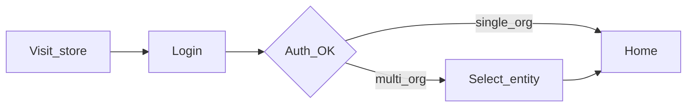
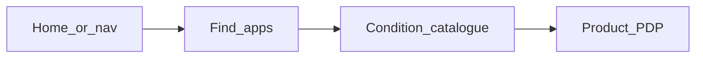
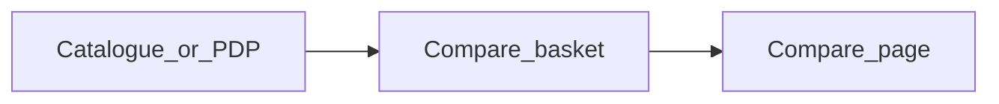
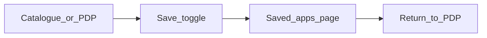
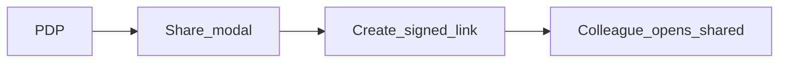
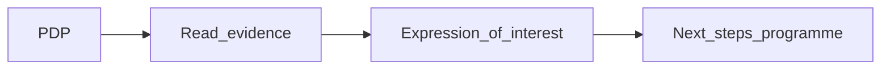
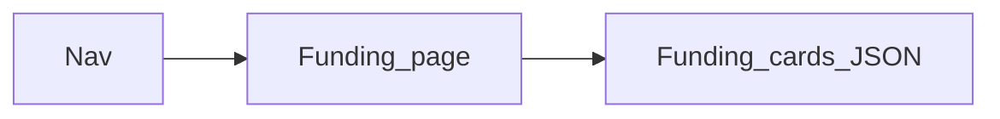

# User journey maps — Commissioner Store (healthstore-alpha)

**Version:** 1.0  
**Audience:** UX design, service design, content design, research; pairs with [`BA_REQUIREMENTS_BASELINE.md`](BA_REQUIREMENTS_BASELINE.md).  
**Scope:** Journeys reflect **as-built behaviour** in this repository unless labelled *Target / programme*. For Epic intent and Alpha Definition of Done gaps, see **§14** in the BA baseline (Jira **UX/UI Commissioner Store**).

---

## How to use this document

1. Use **[Personas](#persona-quick-reference)** and **[Stage model](#shared-stage-model)** consistently across workshops and critique.
2. Each journey links to **REQ / IA IDs** in [`BA_REQUIREMENTS_BASELINE.md`](BA_REQUIREMENTS_BASELINE.md) for BA and test traceability.
3. Rows marked **Prototype** describe today’s interactive demo. **Programme** or **Beta** denotes future NHS capability (auth, MI/BI, procurement case management, etc.).
4. **Emotional curve** entries are **hypotheses** — validate with commissioner research.
5. Engineering detail: share flows → [`SHARE.md`](SHARE.md); compare acceptance → [`compare-page-acceptance.md`](compare-page-acceptance.md).
6. **Screen-level flows** (decisions, branches, routes): [`USER_FLOWS.md`](USER_FLOWS.md).

---

## Persona quick reference

| Persona | Description (as implemented or adjacent) | Typical routes |
|---------|---------------------------------------------|----------------|
| **Primary commissioner (demo)** | Single-env login; lands on home with default commissioning context label when none stored. | `/login` → `/` → catalogue / PDP / compare |
| **Multi-ICB commissioner** | Must select commissioning entity after sign-in before accessing the store. | `/login` → `/select-entity` → `/` → … |
| **Named profile demo** | JSON-backed account with display name, role, organisation — pre-fills Expression of interest fields. | Same as above + EOI modal on PDP |
| **Colleague (share recipient)** | Authenticated user opening a **section-level** shared link; token scoped to commissioning context. | `/apps/[slug]/shared?t=…` |
| **Unauthenticated visitor** | May access **login** and **cookies** only; all other app routes redirect to login. | `/login`, `/cookies` |

---

## Shared stage model

Reuse this horizontal scale on every map. It aligns with Epic language (**discover, evaluate, procure, monitor**) while fitting the prototype.

| Stage | Epic alignment | Typical prototype activity |
|-------|----------------|----------------------------|
| **Orient** | Context-setting | Sign-in, entity selection, home / dashboard band |
| **Discover** | Discover | Find apps hub, condition catalogue, search/filter |
| **Appraise** | Evaluate | PDP, compare tool, funding browse, share/PDF |
| **Decide / act** | Procure (early) | Expression of interest; copy links; *full case workflow = programme* |
| **Follow-up** | Monitor / govern | *Operational reporting = programme*; prototype home copy may imply monitoring only |

---

## Journey 1 — Sign in and enter the store

**Primary persona:** Primary commissioner (demo) or Multi-ICB commissioner.  
**Goal:** Access the Commissioner Store with a clear commissioning context.

### Happy path

| Step | Stage | Touchpoint | System / backstage |
|------|--------|------------|-------------------|
| 1 | Orient | User opens store URL; unauthenticated requests hit **`/login`**. | Middleware + session check ([`middleware.ts`](../middleware.ts)). |
| 2 | Orient | User enters credentials; successful login creates **iron-session** cookie. | [`app/api/auth/login/route.ts`](../app/api/auth/login/route.ts). |
| 3a | Orient | **Primary** user → redirect **home** `/`. | Default commissioning label if applicable ([`lib/commissioningContextDisplay.ts`](../lib/commissioningContextDisplay.ts)). |
| 3b | Orient | **Multi-org** user → redirect **`/select-entity`**; user picks ICB; session updated. | [`app/select-entity/page.tsx`](../app/select-entity/page.tsx), select-entity API. |
| 4 | Orient | User sees **home** with dashboard-style content from JSON. | [`app/page.tsx`](../app/page.tsx), [`content/dashboard/`](../content/dashboard/). |

### Emotional curve (hypothesis)

Neutral (login) → brief **friction** if entity selection is unfamiliar → **reassurance** once nav shows commissioning context.

### Pain points and risks

| Area | Notes |
|------|--------|
| Demo auth | Password-in-env and demo accounts are **not** NHS Login; wrong mental model for production. |
| Entity selection | Multi-ICB users may not understand *why* context is required until copy explains governance. |
| Misconfiguration | Missing `SESSION_SECRET` breaks middleware — ops risk. |

### Opportunities

| Type | Idea |
|------|------|
| UCD | Onboarding microcopy for entity selection; error recovery for session failures. |
| Programme | Replace demo auth with NHS staff IdP (feed **DTX-531**). |
| Content | Align home “monitoring” band with realistic **DTX-530** scope when available. |

### Traceability

`ROL-001`–`ROL-005`, `IA-001`, `IA-010`, `IA-011`, `AUTH-001`–`AUTH-005`, `ORG-001`, `ORG-002`.

### Flow (summary)

---

## Journey 2 — Find and open a product

**Primary persona:** Commissioner (any signed-in variant).  
**Goal:** Discover NICE-relevant apps for a commissioning question and open a trustworthy PDP.

### Happy path

| Step | Stage | Touchpoint | System / backstage |
|------|--------|------------|-------------------|
| 1 | Discover | **Global nav** → **Find apps** or home CTA → **`/apps`**. | [`components/Nav.tsx`](../components/Nav.tsx), [`app/apps/page.tsx`](../app/apps/page.tsx). |
| 2 | Discover | Hub search / navigation → **`/apps/condition-catalogue`**. | [`CatalogueClient`](../app/apps/CatalogueClient.tsx); filters (condition, supervision, maturity, etc.). |
| 3 | Appraise | User opens a card → **`/apps/[slug]`** PDP. | [`app/apps/[slug]/page.tsx`](../app/apps/[slug]/page.tsx); content from JSON ([`content/`](../content/), [`ADDING_APPS.md`](../ADDING_APPS.md)). |

### Emotional curve (hypothesis)

**Curiosity** in catalogue → **cognitive load** if many filters/labels → **trust** if evidence and badges read clearly.

### Pain points and risks

| Area | Notes |
|------|--------|
| Data source | Catalogue is **curated JSON**, not live NICE API — currency must be communicated. |
| Visibility | Some conditions gated in code — commissioners may not see full national range in demo. |
| “Not stated” | Sparse fields weaken confidence; compare [`compare-page-acceptance.md`](compare-page-acceptance.md). |

### Opportunities

| Type | Idea |
|------|------|
| UCD | Filter IA, empty states, progressive disclosure for clinical evidence. |
| Programme | Structured NICE assurance feeds (**DTX-562**); tariff clarity (**DTX-533**). |
| Content | Backfill PDP fields per engineering guides. |

### Traceability

`IA-002`–`IA-006`, `IA-011`, `CAT-001`, `CAT-002`, `CNT-001`, `PDP-001`, `PDP-002`, `SCO-002`, `SCO-003`.

### Flow (summary)

---

## Journey 3 — Compare shortlisted products

**Primary persona:** Commissioner evaluating 2+ options.  
**Goal:** Side-by-side comparison on commissioning-relevant attributes.

### Happy path

| Step | Stage | Touchpoint | System / backstage |
|------|--------|------------|-------------------|
| 1 | Discover | User adds apps to **compare basket** from catalogue or PDP. | [`CompareBasketProvider`](../components/CompareBasketProvider.tsx). |
| 2 | Appraise | User opens **`/compare`** — matrix across selected apps. | [`app/compare/page.tsx`](../app/compare/page.tsx), [`compareFieldFormat`](../lib/compareFieldFormat.ts). |
| 3 | Appraise | User resolves basket limits / URL or storage rules per implementation. | Client state + acceptance doc. |

### Emotional curve (hypothesis)

**Efficiency** if matrix answers the question → **friction** if limits or missing cells block the task.

### Pain points and risks

| Area | Notes |
|------|--------|
| QA | Several acceptance checks in [`compare-page-acceptance.md`](compare-page-acceptance.md) still open — formal UAT needed. |
| Parity | Compare depends on consistent JSON fields across apps. |

### Opportunities

| Type | Idea |
|------|------|
| UCD | Task success studies; highlight “decision-critical” rows. |
| Programme | Tie compare dimensions to **ICB reporting standards** (**DTX-261**) when defined. |

### Traceability

`IA-006`, `CMP-001`, `CMP-002`, basket behaviour under catalogue/compare (`CAT-*`).

### Flow (summary)

---

## Journey 3b — Revisit saved products

**Primary persona:** Commissioner researching over multiple sessions.  
**Goal:** Keep a personal list of products to return to without re-searching the catalogue.

### Happy path

| Step | Stage | Touchpoint | System / backstage |
|------|--------|------------|-------------------|
| 1 | Appraise | User clicks **Save** on PDP or catalogue card. | [`SaveToggleButton`](../components/SaveToggleButton.tsx), POST `/api/bookmarks`. |
| 2 | Appraise | User opens **Saved apps** from nav (`/saved-apps`). | [`BookmarkProvider`](../components/BookmarkProvider.tsx), GET `/api/bookmarks`. |
| 3 | Appraise | User opens **View details** or removes apps from the list. | [`SavedAppsClient`](../app/saved-apps/SavedAppsClient.tsx). |

### Emotional curve (hypothesis)

**Relief** when rediscovery is easy → **confidence** if list persists after sign-out/in on same account.

### Pain points and risks

| Area | Notes |
|------|--------|
| Compare vs save | Users may confuse with comparison tool — intro copy on saved page clarifies roles. |
| Prototype storage | JSON file store (`.data/bookmarks.json`); Vercel serverless needs KV/DB swap. |
| Legacy sessions | Users logged in before `accountKey` shipped must re-authenticate. |

### Opportunities

| Type | Idea |
|------|------|
| UCD | Task success: save → find → reopen PDP; optional “saved date” on cards. |
| Programme | NHS Login user ID, audit trail, team shared lists. |

### Traceability

`SAV-001`–`SAV-004`, `IA-015`, `IA-011`, `AUTH-002` (`accountKey` on login).

### Flow (summary)

---

## Journey 4 — Share evidence with a colleague

**Primary persona:** Commissioner (sender); **Colleague** (recipient).  
**Goal:** Pass a **bounded** excerpt of a PDP to another authorised user, or export PDF for offline.

### Happy path (sender)

| Step | Stage | Touchpoint | System / backstage |
|------|--------|------------|-------------------|
| 1 | Appraise | On PDP, user opens **Share** → modal step 1: link vs PDF. | [`SharePagePanel.tsx`](../components/SharePagePanel.tsx). |
| 2 | Appraise | **Share as link:** user selects sections → **Create link and copy** → POST share API. | JWT (**14-day**), allowlisted keys — see [`SHARE.md`](SHARE.md), [`app/api/apps/[slug]/share/route.ts`](../app/api/apps/[slug]/share/route.ts). |
| 3 | Decide / act | Sender shares URL via email/chat (off-product). | — |
| 4 | Appraise | **Recipient** opens **`/apps/[slug]/shared?t=…`** while signed in; **commissioning entity** must match token. | [`app/apps/[slug]/shared/page.tsx`](../app/apps/[slug]/shared/page.tsx). |

### Optional: PDF path

User chooses **Print or save as a PDF**, selects sections → browser print → Save as PDF; **offline** sharing does not require recipient login (static file).

### Emotional curve (hypothesis)

**Control** (pick sections) → **confidence** if recipient sees same context → **anxiety** if token/org mismatch errors feel technical.

### Pain points and risks

| Area | Notes |
|------|--------|
| Session required for link | Shared **link** path requires logged-in recipient with matching org — not public dossier sharing. |
| No revocation | Track A JWT has no server-side revoke — see [`SHARE.md`](SHARE.md) follow-up. |
| Governance | No audit DB of who shared what with whom (programme). |

### Opportunities

| Type | Idea |
|------|------|
| UCD | Plain-language errors for org/token failure; sender checklist (“recipient needs HS access”). |
| Programme | Track B: persistence, audit, rate limits; align with procurement governance. |

### Traceability

`IA-008`, `SHR-001`–`SHR-005`, `PDP-*` (shared body), `AUTH-005`.

### Service blueprint slice

| Lane | Sender journey | Recipient journey |
|------|----------------|-------------------|
| **Frontstage** | Opens Share modal, configures excerpt, copies link or PDF | Opens link, reads excerpt, may open full PDP |
| **Backstage** | Next.js app, JWT mint/verify, JSON content, session | Same stack; validates token + org match |
| **Other systems** | Email/chat (external) | *Future:* audit store, IdP claims, supplier CRM (**programme**) |

### Flow (summary)

---

## Journey 5 — Express interest (procurement-oriented)

**Primary persona:** Named profile commissioner (demo) or any signed-in user with modal access.  
**Goal:** Signal interest in a product to move toward procurement — **without** a full HS-hosted case workflow today.

### Happy path

| Step | Stage | Touchpoint | System / backstage |
|------|--------|------------|-------------------|
| 1 | Appraise | User reads PDP (evidence, commercial summary, integrations). | PDP sections. |
| 2 | Decide / act | User opens **Expression of interest** (modal or CTA). | Pre-filled read-only fields from profile where configured ([`expressionOfInterestPrefill`](../lib/expressionOfInterestPrefill.ts)). |
| 3 | Decide / act | User submits intent per UX (prototype may **not** persist case or integrate to finance). | **Epic:** full procurement **may sit outside** HS env in Alpha. |

### Emotional curve (hypothesis)

**Interest** on strong PDP → **clarity** if next steps explained → **distrust** if submit feels like a “black hole” with no case ID.

### Pain points and risks

| Area | Notes |
|------|--------|
| Workflow gap | No end-to-end procurement, approvals, or audit trail in prototype — Alpha DoD partial. |
| Expectations | Users may believe submission triggers NHS finance or supplier fulfillment. |

### Opportunities

| Type | Idea |
|------|------|
| UCD | Explicit post-submit messaging (what happens in Beta vs production). |
| Programme | Case IDs, integration to commercial/ops (**DTX-533**), supplier engagement (**DTX-557**), **DTX-531**. |
| Service design | Map handoff to ICB governance and supplier onboarding outside HS. |

### Traceability

`PDP-005`, `ROL-004`, `SCO-001` (prototype positioning).

### Service blueprint slice

| Lane | Commissioner | Organisation |
|------|--------------|--------------|
| **Frontstage** | Reads PDP, completes EOI | Receives signal (future: email, CRM, case tool) |
| **Backstage** | Prototype UI + optional client submit | JSON profiles; *no persisted case in repo baseline* |
| **Other systems** | *Future:* supplier APIs, contract tools, NICE evidence **DTX-562** | Governance for onboarding |

### Flow (summary)

---

## Journey 6 — Explore funding context

**Primary persona:** Commissioner researching commissioning levers.  
**Goal:** Scan funding opportunities related to digital health investment.

### Happy path

| Step | Stage | Touchpoint | System / backstage |
|------|--------|------------|-------------------|
| 1 | Discover | Nav → **Funding** → **`/funding`**. | [`app/funding/page.tsx`](../app/funding/page.tsx). |
| 2 | Appraise | User reads cards/sections driven by JSON. | [`content/funding/`](../content/funding/). |

### Emotional curve (hypothesis)

**Mild interest** — helpful if clearly **indicative** and linked to store purpose.

### Pain points and risks

| Area | Notes |
|------|--------|
| Scope | Funding data is editorial; not transactional apply-within-HS. |

### Opportunities

| Type | Content / programme link |
|------|-------------------------|
| UCD | Cross-links from PDP/funding when programme defines real programmes. |
| Trace | `IA-007`, `FUND-*` in BA baseline. |

### Flow (summary)

---

## Journey 7 — Cookies / transparency (public)

**Primary persona:** Unauthenticated visitor (or anyone checking privacy).  
**Goal:** Understand cookies, analytics (e.g. Hotjar), and controls before or aside from sign-in.

### Happy path

| Step | Stage | Touchpoint | System / backstage |
|------|--------|------------|-------------------|
| 1 | Orient | User opens **`/cookies`** without login. | Public route in [`middleware.ts`](../middleware.ts). |
| 2 | Orient | User reads explanations; may use reset/control patterns on page. | [`app/cookies/page.tsx`](../app/cookies/page.tsx). |

### Emotional curve (hypothesis)

**Low arousal** — builds **trust** if clear and proportionate; **scepticism** if analytics feel unexplained.

### Pain points and risks

| Area | Notes |
|------|--------|
| IG | Prototype copy ≠ DPO-approved production text. |

### Opportunities

| Type | Idea |
|------|------|
| Content / IG | Production cookies policy + consent alignment ([`PRIV-*`](BA_REQUIREMENTS_BASELINE.md) in baseline). |
| UCD | Consent flows if analytics expand. |

### Traceability

`IA-009`, `PRIV-*`, `ROL-001`.

### Flow (summary)

---

## Research hooks (optional next steps)

| Theme | Suggested method |
|-------|------------------|
| Catalogue → PDP comprehension | Task-based usability; “find an app for [condition]”. |
| Compare utility | Success rate + time-on-task; validate row priority with ICBs. |
| Pricing / tariff clarity | Comprehension study vs **DTX-533** drafts. |
| Share / EOI expectations | Semi-structured interviews; avoid **false confidence** in workflow completeness. |

---

## Document control

| | |
|--|--|
| **Maintainer** | UCD / service design lead; sync when IA or auth behaviour changes. |
| **Pairing** | [`BA_REQUIREMENTS_BASELINE.md`](BA_REQUIREMENTS_BASELINE.md) for REQ IDs and Epic §14; [`USER_FLOWS.md`](USER_FLOWS.md) for screen-level flows. |

*End of user journey maps v1.0.*
